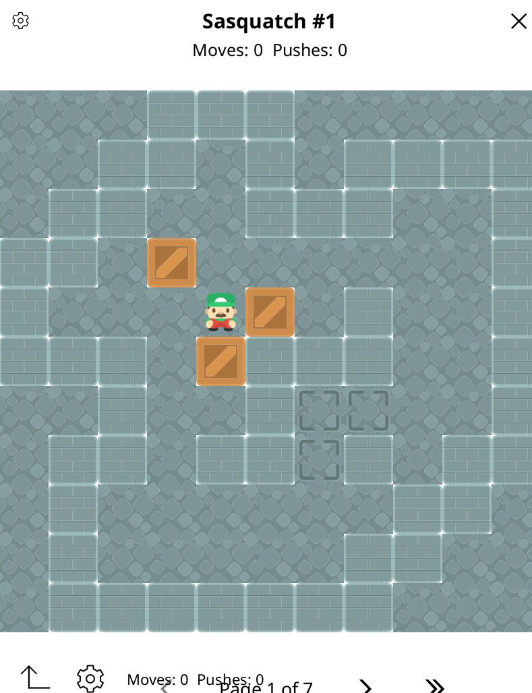

# sokoban.koplugin

A Sokoban puzzle game plugin for [KOReader](https://github.com/koreader/koreader).

Comes with two level sets by David W. Skinner: **Microban** (155 levels) and **Sasquatch** (50 levels).



## Installation

1. Copy the `sokoban.koplugin` directory into your device's KOReader plugins folder (typically `koreader/plugins`)

2. Restart KOReader or reload plugins from the settings menu.

3. Open the **Tools** menu → **Sokoban**.

## Playing

| Action | Gesture |
|--------|---------|
| Move player | Swipe in any direction |
| Undo last move | Tap the ↩ button in the toolbar |
| Open level select | Tap the ⚙ button in the toolbar or title bar |
| Quit | Tap the ✕ in the title bar |

Push all boxes onto the target squares (dots) to solve the level. The move and push counts are shown in the toolbar. After solving, you can proceed to the next level or return to the menu.

## Level select

The level select dialog lets you:

- Choose a **level set** — tap its name to switch (resets to level 1 of that set)
- Navigate levels with the **◀ / ▶** buttons
- Tap **Play** to start

Best scores (moves and pushes) are saved per level and persist across sessions.

## Adding level sets

Level sets are plain Lua files in the `levels/` directory. Each file returns a table:

```lua
local M = {}
M.name   = "My Levels"
M.author = "Author Name"
M.levels = {
    [1] = [[
####
#@$.#
####]],
    -- ...
}
return M
```

Levels use the standard [XSB format](http://www.sokobano.de/wiki/index.php?title=Level_format):

| Character | Meaning |
|-----------|---------|
| `#` | Wall |
| ` ` | Floor |
| `.` | Target |
| `@` | Player |
| `+` | Player on target |
| `$` | Box |
| `*` | Box on target |

After creating the file, register it in `main.lua`:

```lua
local LEVEL_SETS = {
    require("levels/microban"),
    require("levels/sasquatch"),
    require("levels/mylevels"),  -- add this line
}
```

### Converting from .txt files

Level sets distributed as text files (one level per "; N" block) can be converted with the included script:

```sh
python3 levels/convert.py levels/MySet.txt --author "Author Name"
# writes levels/myset.lua
```

## Credits

- **Microban** and **Sasquatch** level sets by David W. Skinner — public domain
- Tile graphics by [Kenney](https://kenney.nl) - Public domain -CCO license
